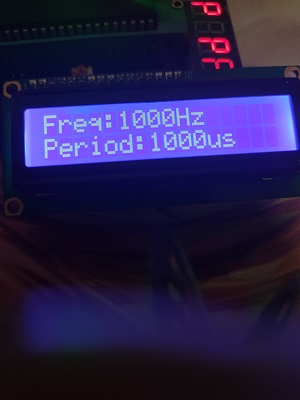
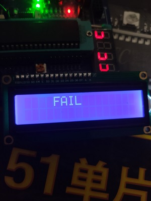

方案描述
====
该文件用来描述解决频率计问题的方案。

*****

|Author|JiangxuanLi|
|---|---|
|E-mail|jonathan1214@foxmail.com|

*****

## 目录

* [版本一](#版本一)
* [版本二](#版本二)
  * [频率显示](#LCD1602显示)
  * [错误更正](#错误更正)

### 版本一

用 `C51` 编写，利用STC89C51有的两个定时器和计数器分别进行定时和计数，具体思路如下：

1. 用`T0`做定时器，`T1`做计数器。
2. `T0` 一共需要计时 1s，按照书上的写法，给出相应的初始值，循环 16 次即可即时 1s，每个循环计时结束时，触发`定时器0`中断，中断服务子函数中重装初值，并使循计数增1，同时判断循环次数是否足够，如果足够，则关闭计数器的计数。
3. `C1`做计数器，打开`Gate`门，信号从`～INT1`中给入，由这个口的信号跳变确定计数，计数满之后（从0开始计数，共65536个），记满之后触发`计数器1`中断，重装初值，并给整循环计数值增1。
4. 频率解码，然后送到数码管进行动态显示，这部分不描述了。

很可惜，这个版本失败了，我不知道错在哪儿了，整个思路没有问题，但是仿真的结果不太正确，也许是因为仿真的时间间隔太短，无法体现出来，又或者是动态数码管显示需要一直占用资源，如果可以并行的话，那问题就解决了，也有可能是这种触发中断的方式太不准确了，或许可以换个思路，将在系一个版本尝试进行进行实现。

附上源文件路径（其实就在当前目录）[main.c](./main.c)

### 版本二

还是用基于`C51`编写，同样利用STC89C51的两个定时器和计数器实现，思路如下：

#### LCD1602显示

这次有所不同，首先显示部分不再用动态数码管做了，动态数码管会一直占用`I/O`口资源，所以我决定使用`LCD1206`来做显示，它有简单的缓存功能，占用的资源并不多，只需要在求出一个频率时写到里面去就好，然后就可以去重新就算新的频率，一直刷新了。总体上我觉得这个思路没有问题，当然显示字符我已经弄好了，其实还是更害怕测频率部分弄不出来，因为频率实在太高了，不管用什么办法处理都可能会错过信息，我开始感觉用 51 不可能解决这个问题，但是现在换成 32 还来得及吗？我心里也没底。

虽然 LCD1602 看起来简单，但做的时候还是踩了不少坑，我不打算在此说明它的引脚计控制方法，只记录坑。

1. 使能信号 `EN` 为一个高脉冲，所以在给出使能信号时，脉冲时间一定要足够长，最开始我用的是`intrins.h`中的`__nop_`函数做延时，我在网上查到这个函数的延时时间是`1us`，本以为时间足够，却没想到出了好些问题，首先是字符无法显示，而字符串可以正常显示，这个问题困扰我很久，再有就是显示字符串时也有可能漏掉第一个字符，比如`hello`显示成`ello`，经过尝试和比较，当我把延时函数换成从别处弄来的可延时 1ms 的函数时，我得到了想要的结果。
2. LCD1602 只能显示 ASCII 码，如果有显示汉字的需求，可以换用 LCD12864。

### 错误更正

不幸地发现自己之前做的工作可能全都是错的，实验的结果不理想，更正如下，完整叙述一遍思路。

1. STC89C52单片机的两个定时器一个用作计数器，一个用作定时器。
2. 定时器计数1s，则这个过程中，计数器记下来的数就是信号的频率。
3. 然后用在LCD1602显示频率值，理论上来说，效果应该是这样的

然而事实上却是这样的

上面就是实际实验得到的结果，我想不到哪儿出了问题，也许单片机根本就不能够完成这个任务，往坏的方面想，高频频率计可不仅仅只有测频率这一个部分，况且待测信号的幅度变化的跨度还不算小，放大这个高频信号时还要进行增益的自动控制，使得不同大小幅度的信号都能被放大到合适的大小，以便后面测频电路的正常工作。

真让人头疼啊，从头到尾就每一个简单的地方，由于对单片机的不熟悉，我在频率计上浪费了很多时间，而且仿真软件不知道怎么了，LCD1602无法正常工作，就算测出来了也不能正确显示，到底是错还是对，完全没有思路。只剩下一周时间了，需要完成两个项目，但我完全没有思路，这靠我一个人是不行的，我也做不到。
